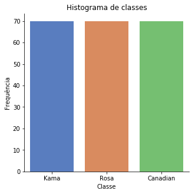
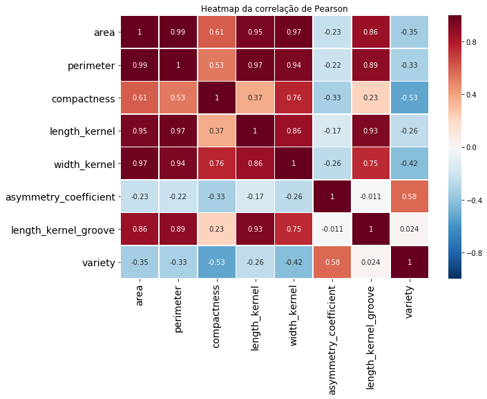
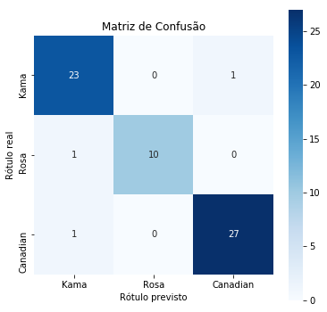

# Atividade 4

## Dupla:

* Felipe Getúlio Laranjeira do Nascimento
* Lucas Pereira Reis

## Importação das bibliotecas


```python
import pandas as pd
import numpy as np
from combination import partitions
from math import *
import seaborn as sns
import matplotlib.pyplot as plt
%matplotlib inline

from sklearn.model_selection import train_test_split, GridSearchCV
from sklearn.neural_network import MLPClassifier

from sklearn.metrics import accuracy_score, confusion_matrix
```

## Realizando a leitura do *dataset*


```python
df = pd.read_csv('seeds_dataset.txt', sep='\t', header=None)
df.columns = ["area","perimeter","compactness",
              "length_kernel","width_kernel","asymmetry_coefficient",
              "length_kernel_groove","variety"]
print(f'Tamanho do dataset: {len(df)}')
```

    Tamanho do dataset: 210
    

# Analisando o *Dataset*

### 1. Histograma do atributo alvo


```python
target_name = "variety"
classes_names = ['Kama','Rosa','Canadian']
g = sns.catplot(x=target_name, data=df, kind="count", palette="muted", height=4.5, aspect=1.0)
g.set_xticklabels(classes_names)
g.set_axis_labels("Classe", "Frequência")
plt.title('Histograma de classes')
plt.show()
```





Conforme pode ser visto no histograma, as classes do atributo alvo são balanceadas, pois o *dataset* possui um total de 210 amostras e cada classe possui 70 amostras.

### 2. Heatmap da correlação de Pearson dos atributos do dataset


```python
plt.figure(figsize = (10,7))
plt.xticks(fontsize=14)
plt.yticks(fontsize=14)

corr = df.corr()

sns.heatmap(corr, xticklabels=corr.columns, yticklabels=corr.columns,vmin=-1, vmax=1,linewidths=.5, cmap = "RdBu_r",annot=True)
plt.title('Heatmap da correlação de Pearson')
plt.show()
```





O *heatmap* acima exibe a correlação de Pearson entre todos os atributos do *dataset*, como pode ser visto o atributo `length_kernel_groove` possui uma correlação de aproximadamente igual a 0 com o atributo alvo `variety`. Assim, optou-se por removê-lo do *dataset*.


```python
df.drop(['length_kernel_groove'],axis=1,inplace=True)
```

# Pré-Processamento de Dados

Antes de começar a utilizar o `GridSearchCV`, precisa-se primeiramente preparar o *dataset* e alguns atributos para serem utilizados na busca.


```python
target = df.variety
df.drop(['variety'],axis=1,inplace=True)
```


```python
input_neurons_amount, output_neurons_amount = len(df.columns), 3
```


```python
X_train, X_test, Y_train, Y_test = train_test_split(df,target,test_size=0.3)
```


```python
def hidden_neurons_amount(alpha):
    return alpha * sqrt(input_neurons_amount * output_neurons_amount)

def condition_to_insert(partition):
    return len(partition) <= 4
```


```python
alpha = [0.5, 2, 3]
hidden_neurons_amounts = [ceil(hidden_neurons_amount(a)) for a in alpha]
hidden_layer_sizes = []

for n in hidden_neurons_amounts:
    tuples = partitions(n, condition_to_insert)
    hidden_layer_sizes += tuples
print(f'Quantidade de possíveis camadas ocultas: {len(hidden_layer_sizes)}')
```

    Quantidade de possíveis camadas ocultas: 396
    

# Parâmetros/Hiperparâmetros para a busca em grade

Na célula seguinte temos os parâmetros a serem passados para as redes neurais. Para o hiperparâmetro *solver*, optou-se por utilizar apenas o `lbfgs` pois o *dataset* desta atividade possui apenas 210 amostras , caracterizando-o como um *dataset* pequeno (com poucos dados). Assim, o *solver* `lbfgs` será mais eficiente e irá convergir mais rápido para o problema.


```python
params = {
    'activation': ['identity', 'logistic','tanh','relu'],
    'hidden_layer_sizes': hidden_layer_sizes,
    'solver': ['lbfgs']
}
```

# Projetando Redes Neurais através da busca em grade

A acurácia foi selecionada como a métrica de desempenho a ser utilizada para as redes neurais do `GridSearchCV`, e o método de validação cruzada escolhido é o *k-fold* com *k* = 3.


```python
gs = GridSearchCV(MLPClassifier(), params, cv=3, scoring='accuracy', return_train_score=1)
```


```python
X,y = df,target
```


```python
gs.fit(X,y)
```


    GridSearchCV(cv=3, error_score='raise',
           estimator=MLPClassifier(activation='relu', alpha=0.0001, batch_size='auto', beta_1=0.9,
           beta_2=0.999, early_stopping=False, epsilon=1e-08,
           hidden_layer_sizes=(100,), learning_rate='constant',
           learning_rate_init=0.001, max_iter=200, momentum=0.9,
           nesterovs_momentum=True, power_t=0.5, random_state=None,
           shuffle=True, solver='adam', tol=0.0001, validation_fraction=0.1,
           verbose=False, warm_start=False),
           fit_params=None, iid=True, n_jobs=1,
           param_grid={'activation': ['identity', 'logistic', 'tanh', 'relu'], 'hidden_layer_sizes': [(3,), (1, 2), (2, 1), (1, 1, 1), (9,), (8, 1), (1, 8), (2, 7), (7, 2), (7, 1, 1), (1, 7, 1), (1, 1, 7), (6, 3), (3, 6), (1, 6, 2), (1, 2, 6), (6, 1, 2), (2, 6, 1), (2, 1, 6), (6, 2, 1), (6, 1, 1, 1), (1, 1, 1,..., 4, 2), (2, 4, 4, 3), (3, 3, 4, 3), (3, 3, 3, 4), (4, 3, 3, 3), (3, 4, 3, 3)], 'solver': ['lbfgs']},
           pre_dispatch='2*n_jobs', refit=True, return_train_score=1,
           scoring='accuracy', verbose=0)


```python
print(f'Quantidade de Redes Neurais projetadas: {len(pd.DataFrame(gs.cv_results_))}')
```

    Quantidade de Redes Neurais projetadas: 1584
    


```python
pd.DataFrame(gs.cv_results_).drop('params', 1).sort_values(by='rank_test_score').head()
```


<div>
<style scoped>
    .dataframe tbody tr th:only-of-type {
        vertical-align: middle;
    }

    .dataframe tbody tr th {
        vertical-align: top;
    }

    .dataframe thead th {
        text-align: right;
    }
</style>
<table border="1" class="dataframe">
  <thead>
    <tr style="text-align: right;">
      <th></th>
      <th>mean_fit_time</th>
      <th>std_fit_time</th>
      <th>mean_score_time</th>
      <th>std_score_time</th>
      <th>param_activation</th>
      <th>param_hidden_layer_sizes</th>
      <th>param_solver</th>
      <th>split0_test_score</th>
      <th>split1_test_score</th>
      <th>split2_test_score</th>
      <th>mean_test_score</th>
      <th>std_test_score</th>
      <th>rank_test_score</th>
      <th>split0_train_score</th>
      <th>split1_train_score</th>
      <th>split2_train_score</th>
      <th>mean_train_score</th>
      <th>std_train_score</th>
    </tr>
  </thead>
  <tbody>
    <tr>
      <th>448</th>
      <td>0.066222</td>
      <td>0.000157</td>
      <td>0.000348</td>
      <td>0.000008</td>
      <td>logistic</td>
      <td>(4, 2, 3)</td>
      <td>lbfgs</td>
      <td>0.972222</td>
      <td>0.884058</td>
      <td>0.840580</td>
      <td>0.900000</td>
      <td>0.055063</td>
      <td>1</td>
      <td>0.847826</td>
      <td>0.865248</td>
      <td>0.957447</td>
      <td>0.890174</td>
      <td>0.048098</td>
    </tr>
    <tr>
      <th>50</th>
      <td>0.058426</td>
      <td>0.000354</td>
      <td>0.000340</td>
      <td>0.000026</td>
      <td>identity</td>
      <td>(2, 4, 3)</td>
      <td>lbfgs</td>
      <td>0.958333</td>
      <td>0.927536</td>
      <td>0.811594</td>
      <td>0.900000</td>
      <td>0.063117</td>
      <td>1</td>
      <td>0.905797</td>
      <td>0.914894</td>
      <td>0.936170</td>
      <td>0.918954</td>
      <td>0.012728</td>
    </tr>
    <tr>
      <th>353</th>
      <td>0.070038</td>
      <td>0.002685</td>
      <td>0.000395</td>
      <td>0.000015</td>
      <td>identity</td>
      <td>(2, 4, 5, 2)</td>
      <td>lbfgs</td>
      <td>0.944444</td>
      <td>0.942029</td>
      <td>0.797101</td>
      <td>0.895238</td>
      <td>0.068658</td>
      <td>3</td>
      <td>0.869565</td>
      <td>0.865248</td>
      <td>0.957447</td>
      <td>0.897420</td>
      <td>0.042482</td>
    </tr>
    <tr>
      <th>390</th>
      <td>0.067096</td>
      <td>0.000481</td>
      <td>0.000418</td>
      <td>0.000053</td>
      <td>identity</td>
      <td>(3, 4, 4, 2)</td>
      <td>lbfgs</td>
      <td>0.944444</td>
      <td>0.927536</td>
      <td>0.811594</td>
      <td>0.895238</td>
      <td>0.058921</td>
      <td>3</td>
      <td>0.898551</td>
      <td>0.886525</td>
      <td>0.985816</td>
      <td>0.923630</td>
      <td>0.044245</td>
    </tr>
    <tr>
      <th>385</th>
      <td>0.068051</td>
      <td>0.001706</td>
      <td>0.000401</td>
      <td>0.000046</td>
      <td>identity</td>
      <td>(4, 3, 2, 4)</td>
      <td>lbfgs</td>
      <td>0.958333</td>
      <td>0.927536</td>
      <td>0.797101</td>
      <td>0.895238</td>
      <td>0.069800</td>
      <td>3</td>
      <td>0.905797</td>
      <td>0.886525</td>
      <td>0.992908</td>
      <td>0.928410</td>
      <td>0.046281</td>
    </tr>
  </tbody>
</table>
</div>


Acima temos o *DataFrame* das Redes Neurais projetadas com o `GridSearchCV` ordenadas pelo campo `rank_test_score`, ou seja, está sendo exibido as cinco melhores redes neurais criadas. É possível retornar apenas a melhor rede neural através do campo `best_estimator_`, conforme abaixo.

# Avaliando a melhor Rede Neural


```python
best_model = gs.best_estimator_
print(best_model)
```

    MLPClassifier(activation='identity', alpha=0.0001, batch_size='auto',
           beta_1=0.9, beta_2=0.999, early_stopping=False, epsilon=1e-08,
           hidden_layer_sizes=(2, 4, 3), learning_rate='constant',
           learning_rate_init=0.001, max_iter=200, momentum=0.9,
           nesterovs_momentum=True, power_t=0.5, random_state=None,
           shuffle=True, solver='lbfgs', tol=0.0001, validation_fraction=0.1,
           verbose=False, warm_start=False)
    


```python
Y_pred = best_model.predict(X_test)
```

Para avaliar a melhor rede neural, será utilizado como métrica a acurácia. Porém também será exibido a matriz de confusão apenas para visualizar o seu comportamento.

## Acurácia


```python
accuracy_score(Y_test,Y_pred)
```


    0.9523809523809523


## Matriz de Confusão


```python
plt.figure(figsize = (6,6))

g = sns.heatmap(confusion_matrix(Y_test,Y_pred),annot=True,square=True,fmt="d",cmap="Blues")
g.set_xticklabels(classes_names)
g.set_yticklabels(classes_names)
g.set_ylabel('Rótulo real')
g.set_xlabel('Rótulo previsto')
g.set_title('Matriz de Confusão')
plt.show()
```




