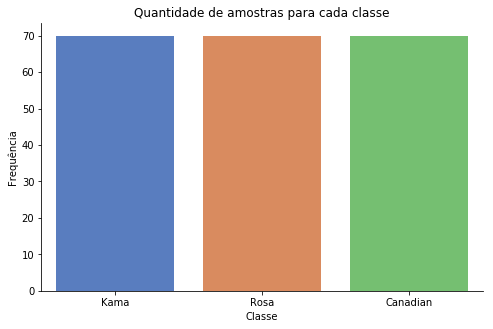
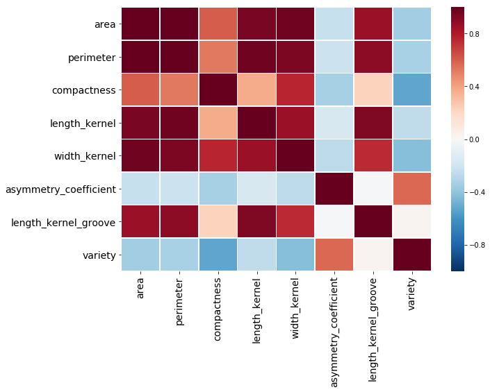

# Atividade 4

## Equipe:

* Felipe Getúlio Laranjeira do Nascimento
* Lucas Pereira Reis

## Importação das bibliotecas


```
import pandas as pd
import numpy as np
import combination as comb
from math import *
import seaborn as sns
import matplotlib.pyplot as plt
%matplotlib inline

from sklearn.model_selection import train_test_split, GridSearchCV
from sklearn.neural_network import MLPClassifier

from sklearn.metrics import accuracy_score
```

## Realizando a leitura do *dataset*


```
df = pd.read_csv('seeds_dataset.txt', sep='\t', header=None)
df.columns = ["area","perimeter","compactness",
              "length_kernel","width_kernel","asymmetry_coefficient",
              "length_kernel_groove","variety"]
```

# Analisando o Dataset

### 1. Histograma do atributo alvo


```
target_name = "variety"
g = sns.catplot(x=target_name, data=df, kind="count", palette="muted", height=4.5, aspect=1.5)
g.set_xticklabels(['Kama', 'Rosa', 'Canadian'])
g.set_axis_labels("Classe", "Frequência")
```


    <seaborn.axisgrid.FacetGrid at 0x1e72408abe0>





### 2. Heatmap da correlação de Pearson dos atributos do dataset


```
plt.figure(figsize = (10,7))
plt.xticks(fontsize=14)
plt.yticks(fontsize=14)

corr = df.corr()

sns.heatmap(corr, xticklabels=corr.columns, yticklabels=corr.columns,vmin=-1, vmax=1,linewidths=.5, cmap = "RdBu_r")
```


    <matplotlib.axes._subplots.AxesSubplot at 0x1e724104320>





# Pré-Processamento de Dados


```
target = df.variety
df.drop(['variety'],axis=1,inplace=True)
```


```
n_i = len(df.columns) #numero de neuronios na camada de entrada
n_o = 3 #numero de neuronios na camada de saida (sujeito a mudanças)
```


```
X_train, X_test, Y_train, Y_test = train_test_split(df,target,test_size=0.3)
```


```
def geometric_pyramid(alpha):
    return alpha*sqrt(n_i*n_o)
```

#### Observação:
Para um `alpha = 2` ou `alpha = 3` o algoritmo para gerar o subconjunto fica bastante pesado. Talvez seja necessário diminuir o valor de `n_i` retirando colunas desnecessárias ou utilizar PCA. Coloquei `alpha = 1` apenas para testar


```
alpha = [0.5,1]
n_h = [ceil(geometric_pyramid(a)) for a in alpha]
hidden_layer_sizes = []

for n in n_h:
    subsets = comb.partitions(n)
    hidden_layer_sizes = hidden_layer_sizes + subsets
```

# Paramêtros para a busca em grade

#### Observação:
Professora pediu pra explicar porquê utilizou tal `solver` para a rede neural. Ela disse que apenas um serviria para o projeto, precisa-se procurar saber qual é


```
params = {
    'activation': ['identity', 'logistic','tanh','relu'],
    'hidden_layer_sizes': hidden_layer_sizes,
    'solver': ['lbfgs']
}
```

# Busca em Grade


```
gs = GridSearchCV(MLPClassifier(), params, cv=3, scoring='accuracy', return_train_score=1)
```


```
X = df
y = target
```


```
gs.fit(X,y);
```


```
pd.DataFrame(gs.cv_results_).drop('params', 1).sort_values(by='rank_test_score').head()
```


<div>
<style scoped>
    .dataframe tbody tr th:only-of-type {
        vertical-align: middle;
    }

    .dataframe tbody tr th {
        vertical-align: top;
    }

    .dataframe thead th {
        text-align: right;
    }
</style>
<table border="1" class="dataframe">
  <thead>
    <tr style="text-align: right;">
      <th></th>
      <th>mean_fit_time</th>
      <th>std_fit_time</th>
      <th>mean_score_time</th>
      <th>std_score_time</th>
      <th>param_activation</th>
      <th>param_hidden_layer_sizes</th>
      <th>param_solver</th>
      <th>split0_test_score</th>
      <th>split1_test_score</th>
      <th>split2_test_score</th>
      <th>mean_test_score</th>
      <th>std_test_score</th>
      <th>rank_test_score</th>
      <th>split0_train_score</th>
      <th>split1_train_score</th>
      <th>split2_train_score</th>
      <th>mean_train_score</th>
      <th>std_train_score</th>
    </tr>
  </thead>
  <tbody>
    <tr>
      <th>4</th>
      <td>0.080784</td>
      <td>0.012296</td>
      <td>0.000333</td>
      <td>4.704712e-04</td>
      <td>identity</td>
      <td>(5,)</td>
      <td>lbfgs</td>
      <td>0.986111</td>
      <td>0.971014</td>
      <td>0.797101</td>
      <td>0.919048</td>
      <td>0.085531</td>
      <td>1</td>
      <td>0.985507</td>
      <td>0.971631</td>
      <td>1.000000</td>
      <td>0.985713</td>
      <td>0.011582</td>
    </tr>
    <tr>
      <th>6</th>
      <td>0.055519</td>
      <td>0.013188</td>
      <td>0.000665</td>
      <td>4.701342e-04</td>
      <td>identity</td>
      <td>(3, 2)</td>
      <td>lbfgs</td>
      <td>0.972222</td>
      <td>0.971014</td>
      <td>0.797101</td>
      <td>0.914286</td>
      <td>0.081977</td>
      <td>2</td>
      <td>0.978261</td>
      <td>0.964539</td>
      <td>1.000000</td>
      <td>0.980933</td>
      <td>0.014600</td>
    </tr>
    <tr>
      <th>0</th>
      <td>0.066487</td>
      <td>0.010751</td>
      <td>0.000333</td>
      <td>4.703588e-04</td>
      <td>identity</td>
      <td>(3,)</td>
      <td>lbfgs</td>
      <td>0.972222</td>
      <td>0.985507</td>
      <td>0.768116</td>
      <td>0.909524</td>
      <td>0.099071</td>
      <td>3</td>
      <td>0.985507</td>
      <td>0.957447</td>
      <td>1.000000</td>
      <td>0.980985</td>
      <td>0.017664</td>
    </tr>
    <tr>
      <th>20</th>
      <td>0.056848</td>
      <td>0.003550</td>
      <td>0.000665</td>
      <td>4.701903e-04</td>
      <td>logistic</td>
      <td>(3,)</td>
      <td>lbfgs</td>
      <td>0.972222</td>
      <td>0.913043</td>
      <td>0.840580</td>
      <td>0.909524</td>
      <td>0.053978</td>
      <td>3</td>
      <td>0.971014</td>
      <td>0.872340</td>
      <td>1.000000</td>
      <td>0.947785</td>
      <td>0.054644</td>
    </tr>
    <tr>
      <th>24</th>
      <td>0.059507</td>
      <td>0.000940</td>
      <td>0.000997</td>
      <td>5.150430e-07</td>
      <td>logistic</td>
      <td>(5,)</td>
      <td>lbfgs</td>
      <td>0.944444</td>
      <td>0.913043</td>
      <td>0.768116</td>
      <td>0.876190</td>
      <td>0.076689</td>
      <td>5</td>
      <td>0.934783</td>
      <td>0.872340</td>
      <td>0.992908</td>
      <td>0.933344</td>
      <td>0.049232</td>
    </tr>
  </tbody>
</table>
</div>


```
best_model = gs.best_estimator_
```


```
best_model;
```


```
Y_pred = best_model.predict(X_test)
```


```
accuracy_score(Y_test,Y_pred)
```


    1.0


# Exportando para *Markdown*


```
!jupyter nbconvert Atividade4.ipynb --to markdown --output resolucao-atividade-4.md
```

    [NbConvertApp] Converting notebook Atividade4.ipynb to markdown
    [NbConvertApp] Support files will be in resolucao-atividade-4_files\
    [NbConvertApp] Making directory resolucao-atividade-4_files
    [NbConvertApp] Making directory resolucao-atividade-4_files
    [NbConvertApp] Writing 6969 bytes to resolucao-atividade-4.md
    
